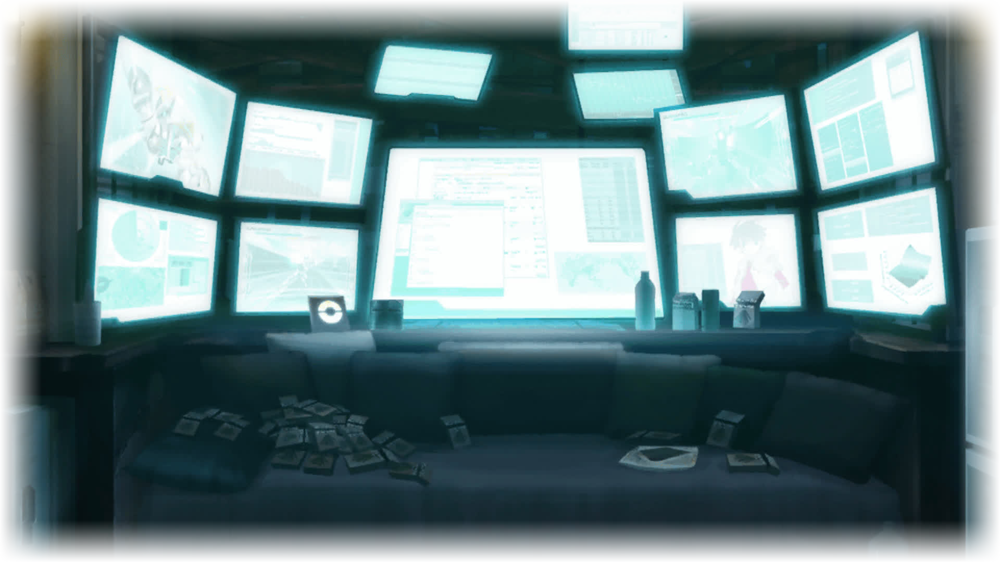
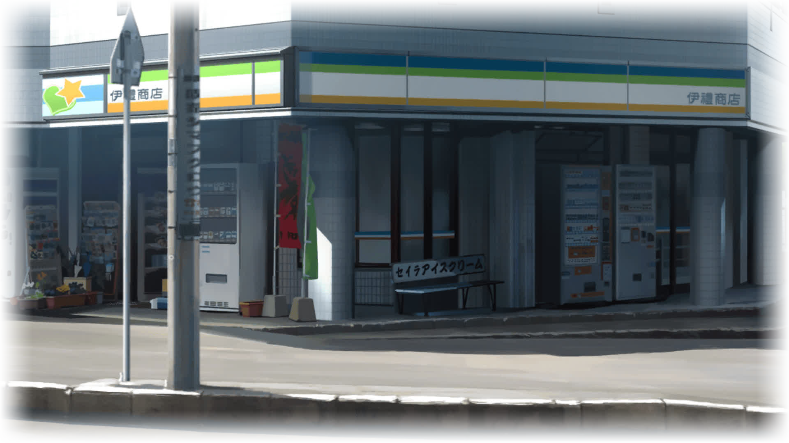
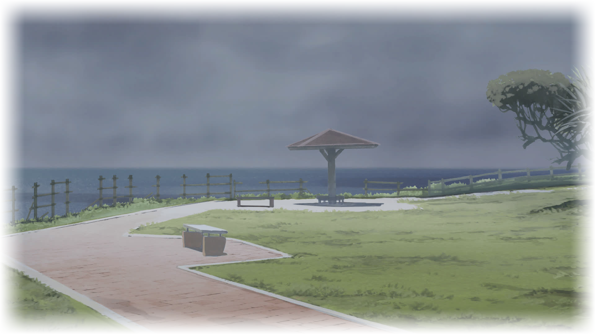

<link rel="stylesheet" href="libs/fontawesome/css/fontawesome.min.css">
<link rel="stylesheet" href="libs/st-action-panel/st-action-panel.css">

<link rel="stylesheet" href="Phase 13.fonts.roboto.css">
<link rel="stylesheet" href="Phase 13.fonts.opensans.css">
<link rel="stylesheet" href="Phase 13.fonts.sourcesanspro.css">
<link rel="stylesheet" href="Phase 13.fonts.notosans.css">
<link rel="stylesheet" href="Phase 13.fonts.lato.css">
<link rel="stylesheet" href="Phase 13.fonts.ptsans.css">
<link rel="stylesheet" href="Phase 13.fonts.karla.css">
<link rel="stylesheet" href="Phase 13.fonts.berenis.css">
<link rel="stylesheet" href="Phase 13.fonts.futura.css">
<link rel="stylesheet" href="Phase 13.fonts.ao3.css">
<link rel="stylesheet" href="Phase 13.fonts.various.css">
<link rel="stylesheet" href="Phase 13.styles.story.general.css">
<link rel="stylesheet" href="Phase 13.styles.story.css">
<link rel="stylesheet" href="Phase 13.styles.twipo.css">
<link rel="stylesheet" href="Phase 13.styles.headers.css">
<link rel="stylesheet" href="Phase 13.styles.text.css">
<link rel="stylesheet" href="Phase 13.styles.actionpanel.css">
<link rel="stylesheet" href="Phase 13.styles.overlay.css">
<link rel="stylesheet" href="Phase 13.styles.responsive.css">

## 「 Fermi Glow Assembler 」
### Phase 13.5
#### “It should work exactly the same way...”

Pouring rain and a strong sea breeze were in the air. During the winter, the winds were always blowing strong over Tanegashima's rural grounds. The air temperature didn't drop much, but due to the strong gusts it felt quite cold... Especially here, on the southern coast.

“Sister Centipede, you know Kai and Aki, right?”

Gazing into the distance, I sent out my question into the void. In the end the direction wouldn't matter anyway.

“Correct.”

Her artificial voice promptly answered, as precisely as it always did.

“Do you like them? Dislike them?”

Without much hope, I shot out my next question.

“Sister Centipede is not equipped with the functions necessary to answer that question.”

Yeah, that sounded about right. Sister Centipede has always been cold like that.

“Then... I release you from this burden.” 

Before I lost myself, I had to do at least that much. I took out my PokeCom and opened the documents app. 

Displayed on its screen was a single icon:  

「Kimijima Report No. 0」

By now, only the original data was left.

I was the one who planted the Kimijima Reports around the island. It was back when I was in high school. I even came up with the flags, just as Kimijima Kou instructed.

And one of the things that he planted inside of me, what you could call the origin of all of this. Right now, without hesitation...

“Go to them. You don't have to stay here any longer.” 

I chose to throw it away.

“Nocchiyo... Sister Centipede.” 

I removed the icon from my screen. And once I confirmed the data was gone, I breathed out a sigh of relief. With this, Sister Centipede would never appear before me ever again.

“Aki... Kai... Come. Hurry...” 

In the end, would you be able to kill me? Such a thing would make me incredibly happy. Just... remember to pay this place one last visit. Because—

What little of myself I kept. 
The part of my soul that's left.

...it may have found a place to rest.

As I entered her place, I was instantly hit by a wall of awful smell and a breeze of cold air. The only real source of light was a concavely shaped grid of monitors. Mounted on the opposite wall, they displayed all kinds of things... ranging from source code files and game maps to various chatrooms and image boards.

And right in front of that gate to a second world sat a figure, that didn't even bother to turn around. Intently staring at some kind of code displayed on the screen in front of her. Frau Koujiro—the genius programmer and maintainer of the massively successful online game Kill-Ballad. As I was gazing on her back, I heard how a single word left her mouth...

“Nullpo.”

Still fixated on that code, not paying the slightest attention to what happened around her.
 

“Huh... what?”

I sent out my question, while putting the two bags I've been carrying to the ground—thankful for an opportunity to finally let go of the heavy weight.

“Gaaaah!”

A sudden scream left her mouth, as she hit herself on the back of her head. I couldn't tell whether she was replying to me, or sending her words to the screen.

“Are you alright, Kona-chan?”

Then, instead of answering my question...

“T-This guy is hopeless... b-better do something about him quick...”

She murmured something I barely even understood. The air conditioner was still going strong as usual, causing her voice to stutter just like it always did.

“Sh-Should have kept you waiting outside like that dog... C-Coming right when I'm about to head to sleep... Tell me, d-do you have any ulterior motives, Senpai...?”

She certainly didn't seem like she was about to wrap up for the day. Besides... it wasn't even noon yet. Ignoring her mindless babbling, my thoughts drifted off to just now, before I entered her place.

That's right—just before her door I saw a small dog, not a lot bigger than a mere puppy. I had no idea where it came from or who it belonged to. Neither seemed Frau, who was shouting at it through the intercom's speakers, desperately trying to chase it away.

“Wh-Would you plea— AAAAAHHH, WHAT ARE YOU DOING?!”

The tiny puppy jumped up at the intercom, probably aiming for Frau's face that was displayed on its screen.

“I-I don't even have any food...! IDGI...!”

It took a while for a flustered young woman to show up, visibly relieved as she saw that little dog. Upon seeing her, it sprinted off right into the woman's arms. Apparently she was its owner, and her pet ran away from her workplace this morning.

It wasn't until she walked off again that Frau was willing to open up the door. She refused to as long as that naughty puppy was in front of the hotel's entrance.

“Say, Kona-chan... you never liked animals, did you?”

Recalling that laughable scene of mere minutes ago, I only felt confirmed in my initial impression.

“E-Each time I visit that place now, t-this new tenants dog keeps following me... T-Tera obnoxious!”

“'That place'?”

Unsure what she meant by it, I repeated her words of just now.

“The Irei General Store.”

Both of us fell silent. Not saying a word, avoiding each other's gaze. Even though Frau had barely known Mizuka-san, she was still being considerate—something, I was deeply thankful for.

I haven't actually been to Mizuka-san's place ever since. I heard her Mom had been taking over the store after that incident, as she was already helping out every now and then. But of course... that wouldn't be a permanent solution.

Once again, the scene at Cape Kadokura came to my mind. Her blood-stained face, the glowing sunset right behind... and far below, the deadly rocks of the southern sea.

I managed to shake off my delusion before it got the better of me. However—I felt reminded of why I came.

“Hey, Kona-chan... What's the progress so far?”

Upon hearing my question, a blank expression formed on her face.

“What... progress...?”

Mouth agape, with her eyes wide open, she seemed to be caught in a state of shock. Almost as if someone pressured a knife into her throat.

A bad feeling began to grow somewhere deep in my stomach...

“Weren't you—”

I began to word my question, in an attempt to gain clarity about my worries. However, I didn't get very far before—

“But I refuse!”

Frau suddenly snapped back to her senses, screaming out her denial right in front of me. The gut feeling I got before worsened.

“Hah...?! You haven't actually done anything?!”

“H-Hacking into IRUO. is way beyond my abilities, d-didn't I tell you?”

I vaguely recalled something she told me over the course of last summer. That it would take her months to analyze its defenses alone.

But... if that's the case, then—

“Hold up. That means... you were lying?”

For a few seconds Frau went silent. The expression on her face unchanged, almost as if it was frozen.

Then, all of a sudden—

“Pawahara!”

Her eyes widened, and her face became furious. As she spoke, her voice began to stutter even more...

W-W-What baseless claims...! O-Officer, g-give this guy a c-cell ASAP...!”

She pulled up her PokeCom and began to dial some sort of number.

“Wait... calm down, Kona-chan...”

Things would get problematic if she actually called the police...

“You still want those two bags, don't you?”

I directed my gaze at the two heavy-weighted bags I brought with me. Upon realizing what I was getting at, Frau immediately froze in place. Then... after a few seconds, she lowered her PokeCom again.

I breathed out a sigh of relief... Not at all had I expected her to freak out like that. Apparently I really stirred up a hornet's nest, huh?

“Th-Thanks to S-Sawada-kyun I could outsource...”

She was referring to Sawada Toshiyuki. Section chief of Exoskeleton's HUG Testing Department, and the very person that has been fighting the Committee of 300 from within its own ranks.

“So... who did you outsource to...?”

My curiosity grew, so I dug deeper. However—

“D-Don't worry Senpai, F-Frau-chan got you covered... Duhuhu...”

Quite obviously, she was trying to evade the question.

“How couldn't I worry unless I know who it is...?!”

Right then, a sudden sound echoed throughout the room. Apparently it came from Frau's PokeCom, that was still in her hands. Upon hearing the notification, she unlocked the screen—and began to read some kind of mail.

“'M-My 2D wives longed for my presence'. W-What a legit excuse, lol.”

An crooked smile formed on her face as she read through the mail's contents. I got a bad feeling about this...

“Who's that, Kona-chan?”

I tried to peek over her shoulder, taking a look on her screen. Displayed on the tablet's monitor was a lengthy message, filled with all sorts of lingo I didn't understand. Almost immediately, the sender's name caught my eye...

It felt vaguely familiar. I felt like I heard it I once before, not too long ago. However, before I could recall where it was—

“...r-reading a virgin's mails, huh?”

A low voice came from right inside my head.

“—WOOAAAH?!”

I jumped back in shock, as I realized Frau whispered straight into my ear.

“J-J-Just what are you gonna do...? L-Leak my hidden secrets on @channel's f-filthy boards...?! S-Steal Kill-Ballads u-unpublished cheats...?!”

Still struggling to recover from that sudden voice, I ignored her absurd accusations. After reading the mail's sender, I couldn't let her off the hook that easily.

“Who... who is that? Did you outsource to him...?”

Upon hearing my question, a hard to judge expression formed on Frau's face. I couldn't really tell what was going through her head as her next words reached my ears.

“The epitome... the best of the best... And yet, for three whole days... not a single reply...”

She began muttering something to herself. I wasn't sure if she was aware I could hear it...

“What...?”

I shot her a questioning glance.

“Y-You're one to talk, n-not even telling me about why you want this from me...!”

That's right...

A few days ago—on the same day me and Akiho were in the hangar with Misa-nee—I went to her, asking whether she could do me that one favour. Even so, I haven't revealed Misa-nee's request to Frau yet.

“W-Where's the original at, anyway?”

Hearing her question, I listened up.

“The 'original'? What do you mean?”

Frau pulled up a data sheet on one of her monitors. I could see all kinds of technical details that probably belonged to what brought me here.

“F-FYI, PokeCom documents include a revision history.”

A list of apparent changes appeared on the screen right in front of me.

“T-The timestamps of the last two modifications differ by years, w-with the last one being set just a few days ago.”

She opened some sort of program that displayed two documents right next to each other. One on the left, the other on the right side.

“W-What's more... is that the contents d-didn't change at all.”

I could tell the parts of the documents shown on screen matched each other perfectly. It appeared as if the two of them were one and the same.

“Whatever... I don't care about them being the original contents or not. As long as everything works the same there's no reason to worry.”

Frau suddenly seemed annoyed, as if I exasperated by my ignorance.

“I-Imitating that behaviour is ridiculously difficult! You don't want them to strand anywhere, i-in the air or on sees, let alone the translations...”

“Oh, that's right... What people are doing them now?”

Indeed, that has also been part of my favour. Even though it came as an afterthought... After all, we're aiming for a global scope.

“R-Ridicolous to assume multiple people. Just focus on one language. 2ez.”

What was that supposed to mean now?

She began typing on her keyboard, apparently conducting a search on Deluoodle. After some time she opened some kind of web blog. I read the title and became confused...

“'Tempus Edax Rerum'... What does that even mean?”

Instead of answering my question, Frau went on with her own trail of thought.

“N-Never did BL books, yet his quality is striking... G-Gained quite the reputation over the last d-decade or so. Duhuhu...”

I assumed she was referring to the translator. And regarding that page in front of me... I don't necessarily need to understand, do I?

“Well, I guess that part is covered. More importantly, then...”

The actual reason why I entrusted Frau with this task. It's certainly not been translations that I required her skills for.

“Is it done...?”

I asked, almost positive about it.

“Deliver plz.”

I should have expected that much. Actually, I would have been thankful if all she wanted was money, but...

“Geez, why couldn't I just order them?”

I placed the bags in front of her. She sure kept me paying a high price... Upon seeing their contents, Frau's eyes took on a strangely excited look.

“'Hell in the shade of moonlight', and that one... 'Devil's feast amidst the flames'... It's all there!”

Needless to say, those were BL manga. Special editions, only available at a certain store in Nakatane. Perhaps the only place on the whole island that actually offers that type of content.

“I can't even go close to that shop ever again...”

The worst thing probably was that I used to know the store's owner... Bound to happen, as the place was right next to the Irei General Store. I still remembered the odd looks he shot me as I went to the cash register.

“So then, Kona-chan. Now it's up to you.”

However, she didn't appear to listen...

“Th-This scene... It's totes cosplay content. Duhuhu... Y-Yashio-senpai, go get Four Eyes...! Listen to your inner demons...! Succumb to the devil's choir...!”

*Like hell I would!*

“Ko—na—chan.”

I stretched each syllable, so as to get her attention.

“I held up my end of the bargain, you can't just request a new one now.”

“Duh...”

As my words hit her, she instantly went silent—a huffy expression painted on her face.

“So... let's get back on topic.”

I made another attempt to get her on track again. Talking with Frau sure took effort...

“Say, Kona-chan. Is it done?”

She picked up her PokeCom again. Right before—as she was digging through the loads of BL content I placed in front of her—she dropped it to the floor, where it has been lying up until now.

“L-Let me take a look...”

This time, she turned straight at me before opening the mail. Probably to avoid me taking a look over her shoulder again...

“G-Guess he really is a S-Super Hacka...”

Judging by her almost inaudible whisper, Frau seemed to be in deep awe of what she had in front of her.

“So... it is?”

I didn't receive a reply. Instead, I heard a notification sound from my own PokeCom. I pulled it up and took a look on the screen.

— Incoming Transmission: Report_0_2nd_EDITION_ver._1.54_rev._1.12 —

“The hell? What's with that kind of naming sense...”

A ridiculously long amount of characters were part of the filename, apparently indicating the version. However, in front of them all, I could still see the document's original title.

“That file is e-everything you need.”

Back then, on that very day. After leaving the airport I payed Mizuka-san's place of death one last visit. Yet... it wasn't her that I came there for.

“B-Basically, you j-just need to open it. That's all...”

After hearing Misa-nee's very last words, my body almost dragged me out there on its own. As I was looking for Kimijima Report No. 7, I only checked the area around the shrine. However, on the southern side, placed right at the cliff—I found another geotag.

I had no idea how long it has already been waiting there. Yet, upon seeing its strange power mark, there was no doubt about its contents. That's why—

“...i-it should work exactly the same way. 2ez.”

We could take advantage of it.

After all... the reports worked based on the principle of propaganda. Causing mass-hysteria everywhere, by flooding the world with their apparent truth. Resulting in individual believes to vanish, as they joined the opinion that spread amongst the masses.

In the end, it wasn't merely due to Misa-nee's request. Even without it I would have shared her feelings. That's why, eventually, I decided to go here. And pay that oddly perverted girl right in front of me just another visit.

Because... despite her quirks, it still held true Frau was a genius programmer. Whether outsourced or not—without her help, I wouldn't ever have had the chance.

“Thank you, Kona-chan.”

After expressing my gratitude, I accepted the transmission. With this Misa-nee's past was back in my hands. And responsibility for it rested upon my own two shoulders. 

That's why... even as I left Frau's apartment, I was still pondering when to pull the trigger.

##### — Final Phase —

<a href="Phase 13.6.html">「 Heliotail Disperser 」</a>

<a href="Phase 13.6.html">「 Heliotail Disperser 」</a>

