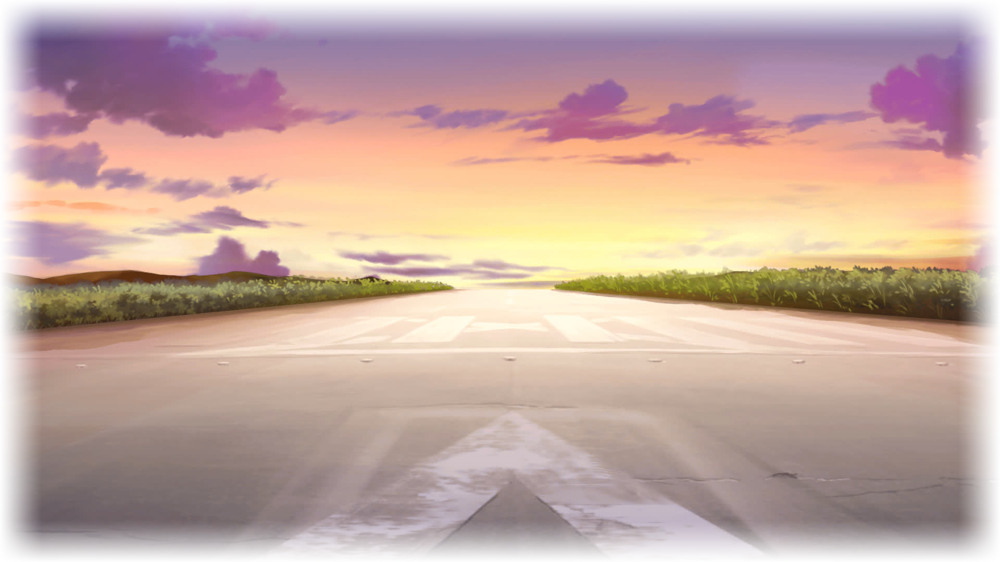

<link rel="stylesheet" href="Phase 13.fonts.berenis.css">
<link rel="stylesheet" href="Phase 13.fonts.notosans.css">
<link rel="stylesheet" href="Phase 13.styles.story.general.css">
<link rel="stylesheet" href="Phase 13.styles.story.css">
<link rel="stylesheet" href="Phase 13.styles.twipo.css">
<link rel="stylesheet" href="Phase 13.styles.headers.css">
<link rel="stylesheet" href="Phase 13.styles.text.css">
<link rel="stylesheet" href="Phase 13.styles.responsive.css">

## 「 Heliotail Disperser 」
### Phase 13.6
#### “After all... that's the Misa-nee we want to see.”

I stood at the empty airport apron. The hustle and bustle of a few days ago completely vanished, leaving behind a silent and peaceful atmosphere. Somewhere in the distance I could hear the leaves of trees rustling in the cold morning winds.

Right after leaving Frau's room I decided to come here. To the place that should become my last opportunity to spend time Misa-nee. At least... for a while to come.

Super GunBuild-1—proudly standing here just a few days ago—was now nowhere to be found. That's because—

“Indeed... this is going to become a good attraction at this year's festival! Now that's IMPACT! Gahaha...”

Probably for promotional purposes, Mr. Candy decided to move him closer to his company. One day after our battle, he was put on Doc's cargo bed again, and driven across half the island. Straight to Nishinoomote, where the Space Candy headquarters were located.

Not that I particularly cared about what happened to Super GunBuild-1 now. Perhaps it was actually better for it to be up there. At least, Nishinoomote's harbor was where most visitors would arrive on the island. For an attraction it was certainly a better location than this old airport's runway in the middle of nowhere.

Leaving GunBuild-1 aside, my thoughts drifted off to Misa-nee.

On that day, right after the paramedics picked her up, she was transported to the General Tanegashima Hospital. As direct relative, Akiho has already been allowed to see her. And indeed— 

“I'll visit... I'll visit as often as I can, as soon as possible...”

Whenever she had enough time on her hands, she would get on her scooter and head right to Minamitane. With the graduation ceremony being mere days ahead there weren't a lot of reasons to still visit school—so she stopped by almost each day. I myself, however...

Even now, several days after our battle—I haven't found the courage to do so. The way I've seen Misa-nee in that abandoned airport hangar—her mind barely conscious, her thoughts more lost in a delirium than connecting with the world around her. It was that exact same way that I kept her on my mind ever since. An image that I still wasn't able to let go off.

Of course, I wanted to visit her. After all... Misa-nee still meant a lot to me, just like she did to Akiho. So just today—I finally made my decision. Early this morning, right before visiting Frau, I picked up my scooter and set out for the hospital. In the dim light right before sunrise its bleak facade almost seemed hostile as I approached the entrance.

Even though visiting hours already started, I was still worried about coming at this time of day. Except for the hospital staff I came across no one else as I walked through the building's endless corridors. To avoid bothersome questions I refrained from asking—so it took me a while to find Misa-nee's room.

And as I finally did... I hesitated.

Her door was right before me, yet I felt unable to move an inch. As if paralyzed, with one hand on the door handle—I just stood there, feeling like some kind of weirdo.

That's why... as the door suddenly opened, I reflexively winced. Right in front of me appeared Akiho, a bewildered expression painted on her face.

“K-Kai... What are you doing here...?”

She was clearly not expecting to see me there at all. Indeed, I could imagine her surprise after I refused each of her offers to visit Misa-nee together.

“Are you here for Big Sis...?”

At this point, I decided to postpone my visit. Perhaps I was just giving in to my anxiety... but on the other hand, it was still quite early in the morning. And I didn't really want to barge into her room right after her sister.

“Say, Aki-chan... is Misa-nee fine?”

As my words reached her, a gloomy shadow passed over her eyes.

“The doctors said they don't know when she'll be fully conscious again...”

Apparently, she was still in some sort of coma. Occasionally she would attempt to mumble something, but... according to Akiho, she wasn't able to hold a proper conversation. So all she could do was sit by her side and listen.

“...you've only... ever been average.”

Back then—even if just for a few moments— she seemed like her past self. Having returned to the very same person we knew ever since our childhood. Now, however... Misa-nee appeared a lot more distant than ever before.

Just how many days would pass by until she woke up? And the very moment her eyes were about to open... just what would remain—of that boastful and incredibly haughty Misa-nee, the two of us came to like that much?

Shaking of my memories, I took out my PokeCom and opened the documents viewer.

Nine icons appeared right in front of me. Seven of which were responsible for the chaos that spread out all over the world, not too long ago. An eighth one I found mere days before, upon paying Mizuka-san's place of death one last visit. The last one though... remained entirely untouched, still waiting to be opened.

My finger moved over the icon.

“Misa-nee... this is also for your sake.”

The reveal of her memories, that almost ended up being lost. Unpublished memoirs depicting the puzzling life of a strange girl.

“Perhaps... it's going to help a bit.”

Right now, on the mass-media just as on Twipo... the debate was still going strong. Senomiya Misaki—whether she was a hero or a villain, none of that has been entirely judged yet.

It matters not how strait the gate. 
How charged with punishments the scroll.

That's why... I kept hoping. Believing in a future, that Misa-nee was part of again. One distant day, that me and Akiho could spend with that oddly confident and overly conceited girl once again.

“After all... that's the Misa-nee we want to see.”

As I spoke those words... I felt how my fingertip touched the icon. And right then, as I launched the payload—a certain image came to the back of my mind.

Nine years ago, on one of those days... We were sitting on a bench in Uchugaoka Park, a mass of people around us. All of them eagerly waiting, following the countdown voice from the speakers.

And just like back then... as the white fountain of smoke shot up in front of us, growing taller by the second. The words she would scream against the sky, straight in the direction of that man-made lump of metal. Right as it cut through the clouds—and rose up into the heavens.

“Gooo, hot dog! Gooo!”

Resonating all over this old airport's runway, I heard my words spreading out into the distance. For a little while their echoes kept reverberating in the air, before they gradually faded out across the islands' endless hills and countless valleys.

And just the same in the augmented place—where no eye could see, and no hand could reach. A myriad of pieces scattered once again. Filling in the unseen gaps... and giving shape to yet another truth.

“Say, Misa-nee... that dream of yours.”

I recalled her wish of almost ten years ago. The events that gave birth to her steadfast goals, and to her unwavering determination.

“Has it finally come true...?”

&nbsp;
*****
&nbsp;

Once more:

— Mysterious report file appears all over the world —

&nbsp;

Dear readers,

I'm sure a lot of you might have noticed: Just like it happened at the beginning of this year, once more a mysterious report file has started appearing all over the world. Not merely in Tokyo and Shibuya, there have also been confirmed sightings in Paris and Madrid, and Twipo users also mention they've seen them appear in London and New York.

What's more, is that the file is titled ***“Kimijima Report No. 0”***. Feels quite familiar, huh?

Kimijima Kou, the mastermind that appeared in @M_NAGAFUKADA's livestream just a week ago. The very person that was supposed to have been defeated and eliminated by the brave members of the ***“C.T. Robotics Club”***, who faced him in an heroic battle using their incredible ***“Super GunBuild-1”***.

After the sudden appearance of yet another report file we might be tempted to believe he has returned. However, dear readers, before you gasp in shock: Please take a look at the report's contents. They weren't written by Kimijima Kou himself. Rather—and now hold your breath—they origin from the overly popular face of Exoskeleton Company: ***Miss Senomiya Misaki***.

That's right. After all this, she seems to have left behind one last message. Memoirs that all of us should learn about, and that could very well flip the image of her upside down in your head!

However, let me not make this another prime example of sensationalist news reporting. I received way too many complains about that in the past... Rather, let's also look on the other side: What if this is just another attempt by Kimijima Kou? What if he indeed returned, and again spreads wrong information?

Don't let yourself be fooled! What's your opinion on those unexpected events? Let's get this straight and discuss it in the comment section! 

#KUROKANENEWS

&nbsp;
*****
&nbsp;

**ATSUMI_JAN** *@Atsumi_Jan*  
\#KUROKANENEWS is at it again...
  

**BALANCE_BOY** *@Balance_Boy*  
So what's this all about? Recently everyone seems to go nuts about a second Kimijima Kou... Is he actually back?
  

**CHELLYHEART** *@ChellyHeart*  
Wait, are you serious? If that's true then I'll go take a look for the reports right away...
  

**FU_ARAX** *@fu_arax*  
Almost positive those reports are fakes again. Kimijima Kou is definitely back... Don't fall for that BS another time!
  

**ATSUMI_JAN** *@Atsumi_Jan*  
>let me not make this another prime example of sensationalist news reporting  

Good job at doing so lmao. That article is already the #1 topic all over @channel and Twipo...
  

**ATSUMI_JAN** *@Atsumi_Jan*  
@Balance_Boy Who knows... It's just KUROKANE reporting, so it could just as well be fake in and of itself lol
  

**DJMAZ** *@djmaz11*  
Wait... WAIT! So that wasn't actually a troll? I've seen one of those reports right outside my house! 'Gotta catch them all, m8's...
  

**G_SKY3000** *@g_sky3000*  
@fu_arax Nonsense! Just stay on the right side of the information divide... Kimijima Kou is dead for good.
  

**ENDER_6** *@EnderJohnson*  
@ChellyHeart @Atsumi_Jan It's all true. Can confirm. I've just finished reading that file myself and holy cow—IT'S WILD!
  

**ENDER_6** *@EnderJohnson*  
@djmaz11 Dude... it's just a single file, spare yourself the extra effort this time ROFL
  

**Lightning-Fast Neidhardt** *@NEIDHARDT*    
@fu_arax My senses tell me it's got nothing to do with him this time. At least, that's what my precious Seira-tan told me. Hehehe...
  

**DJMAZ** *@djmaz11*  
@EnderJohnson too bad... Was already looking forward for another scavenger hunt :sad:
  

**DaSH** *@Dash*    
@NEIDHARDT We all know you're a hikkie, but please... Proper judgement happens based on eroges, kk?
  

**ATSUMI_JAN** *@Atsumi_Jan*  
@EnderJohnson U srs? Or are you just one of KUROKANES alts lol.
  

**ENDER_6** *@EnderJohnson*  
@Atsumi_Jan Never even bothered to read his junk... It's first-hand information by myself.
  

**Hououin Kyouma (bot)** *@Phenix_in_CrimsonTruth*  
@Atsumi_Jan The organization's hidden agents. I see—you've finally shown yourself...
  

**ATSUMI_JAN** *@Atsumi_Jan*  
@Phenix_in_CrimsonTruth Excuse me... are you accusing ME of alt-ing?????
  

**DJMAZ** *@djmaz11*  
I just opened it...  
>"I like you...”  

Just wth is with this girl? Is she some sort of weirdo...?
  

**ENDER_6** *@EnderJohnson*  
@djmaz11 Read on... you'll understand eventually ＼(＾O＾)／
  

**BALANCE_BOY** *@Balance_Boy*  
Can someone plz upload the deetz? Have searched for those reports all day long, still no luck :disappointed:
  

**ENDER_6** *@EnderJohnson*  
@Balance_Boy @djmaz11 Please, guys... those emotes don't work on Twipo www. Anyway, I'll upload when I'm at home.
  

**BALANCE_BOY** *@Balance_Boy*  
@EnderJohnson Thanks!
  

**CHELLYHEART** *@ChellyHeart*  
OMG! I just had multiple instances of that report appear in my street! Seems like they're still spreading...
  

**FU_ARAX** *@fu_arax*  
@Balance_Boy @ChellyHeart @djmaz11 @EnderJohnson can you all please just STOP? You know how that Project Autum thing DID happen...?! Want it to happen AGAIN...?!
  

**ENDER_6** *@EnderJohnson*  
@fu_arax Calm down and finally read them... This isn't like last time at all.
  

**CHELLYHEART** *@ChellyHeart*  
Half way through and holy crap... So it really seems that hostage scene in @M_NAGAFUKADA's stream was not an act, huh?
  

**FU_ARAX** *@fu_arax*  
@ChellyHeart @EnderJohnson You fools... Don't you realize you're being brainwashed?
  

**DJMAZ** *@djmaz11*  
Finished the first section. I swear I've seen that Airi girl once before. Must have been somewhere at Uchugaoka Park... Feels scary as hell.
  

**BALANCE_BOY** *@Balance_Boy*  
@djmaz11 Wait, isn't that an urban legend? So she actually exists?
  

**ENDER_6** *@EnderJohnson*  
@ChellyHeart Almost certainly not an act, no... @Balance_Boy It's no urban legend—there are quite a few recordings on MewTube, actually.
  

**DJMAZ** *@djmaz11*  
Received a message from a friend abroad (@MAGNETLOCK). He's spending his gap year in the UK. Apparently he had the reports appear in his city too... And they were in English!
  

**BALANCE_BOY** *@Balance_Boy*  
WTF!! I just checked Deluuodle Images... That girl—Airi was her name, right? She looks EXACTLY the same! She's just like the girl in @M_NAGAFUKADA's stream...!
  

**Mitsuhiko Nagafukada** *@M_NAGAFUKADA*    
@Balance_Boy You'll be surprised to hear she also has the same name. That's a pro tip!
  

**CHELLYHEART** *@ChellyHeart*  
@djmaz11 Seriously? Who did the translations...?
  

**DJMAZ** *@djmaz11*  
@ChellyHeart idk, can't be Kou's doing this time... Probably some garbage MTL anyway ＼(＾O＾)／
  

**Steiner** *@DistantValhalla*  
@djmaz11 That one hit too close to home...
  

**ENDER_6** *@EnderJohnson*  
@Balance_Boy Alright, there you go... Uploaded them <a class="twipo-handle-blue" href="https://httpstat.us/503">here</a>.
  

**BALANCE_BOY** *@Balance_Boy*  
Thanks again! Currently downloading...
  

**ILOVEK2** *@I_love_K2*  
@EnderJohnson That last part is absolute insanity...  Must have been a nightmare for poor Misa-chan 
  

**JINGUY_53** *@Jinguy_53*  
@EnderJohnson Artificial Intelligence sure is a scary thing... Almost feels like some movie transcript ＼(°o°)／ (Is it one? lol)
  

**NORIKINDOM** *@NorthernKingdom*  
@EnderJohnson FYI, that link just gives a 503 error now. Server probably overloaded... w(°ｏ°)w
  

**CCNONOBESTGIRL** *@NonoKurusu*  
Someone pls reupload...
  

**O_ZYA** *@ozya23*  
Anyone who still has that file? @EnderJohnson Can you please upload somewhere else?
  

**PAPB** *@papb100*  
It's been a day since... Noone who can reupload? (╯︵╰,)
  

**MAGNETLOCK** *@Magneto342*    
Am that UK guy from @djmaz11's tweep... Uploaded the English version here  
...
  

**PAPB** *@papb100*  
@MAGNETLOCK My Englisch sux, but thx!
  

**CCNONOBESTGIRL** *@NonoKurusu*  
@MAGNETLOCK Holy crap, that report is indeed crazy... Feel bad for Misaki-san, honestly. Thanks for sharing!
  

**O_ZYA** *@ozya23*  
@MAGNETLOCK Thanks a lot!
  

**Steiner** *@DistantValhalla*  
Japanese people reading English localizations... Just what world do we live in? (￣ω￣;)
  

**Blick Winkel** *@blockwonkel*  
@DistantValhalla Perhaps consider doing ENG → JP translations in the future wwww
  

**Steiner** *@DistantValhalla*  
@blockwonkel NEVER!
  

##### —FIN —

「 Thanks for reading! 」

